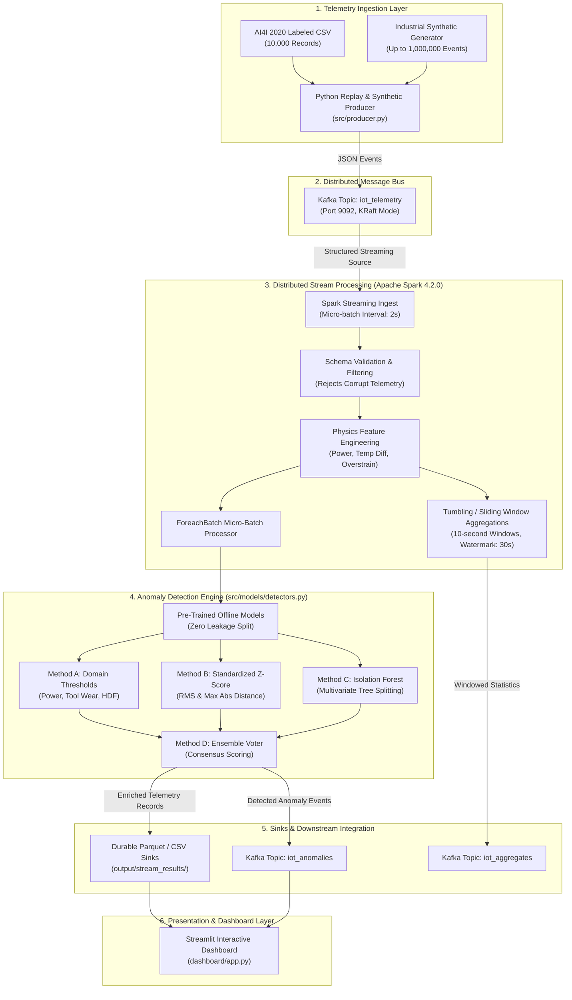

# System Architecture: Real-Time Industrial IoT Anomaly Detection Pipeline

## 1. Overview & Baseline Comparison

This document details the architectural design of the **Real-Time Industrial IoT Anomaly Detection and Scalable Stream Analytics** system, comparing the baseline starting implementation against our extended, production-grade distributed pipeline.

### 1.1 Baseline Starting Point
- **Original Repository:** [yugokato/Spark-and-Kafka_IoT-Data-Processing-and-Analytics](https://github.com/yugokato/Spark-and-Kafka_IoT-Data-Processing-and-Analytics)
- **Original Implementation Scope:**
  - `iotsimulator.py`: Python 2.7 script generating synthetic JSON messages representing ambient temperature across 50 US states (`{"guid", "destination", "state", "eventTime", "payload": {"format", "data": {"temperature"}}}`).
  - `kafka-direct-iotmsg.py`: Spark DStreams job utilizing deprecated `KafkaUtils.createDirectStream` and Python 2 syntax.
  - Analytics: Simple RDD transformations computing average temperature per state, total message counts, and sensor counts.
  - Sinks: Printed directly to stdout via `DStream.pprint()`. No durable storage, no feature engineering, and no anomaly detection.

### 1.2 Proposed System Extension
Our proposed extension transforms the educational prototype into a robust industrial predictive maintenance and streaming anomaly analytics pipeline:
- **Runtime:** Upgraded to modern Python 3.14 and Apache Spark 4.2.0 Structured Streaming.
- **Dataset:** Ingests the empirical **UCI AI4I 2020 Predictive Maintenance Dataset** (and high-fidelity synthetic telemetry for stress benchmarking).
- **Physics-Informed Features:** Computes temperature differential ($\Delta T$), mechanical power ($P = \tau \cdot \omega$), and tool overstrain ($S = W \cdot \tau$).
- **Multi-Method Anomaly Detection:** Implements a uniform detector abstraction supporting:
  1. *Method A:* Physical Domain & Rule-Based Thresholds
  2. *Method B:* Statistical Distance / Standardized Z-Score
  3. *Method C:* Multivariate Tree-Based Isolation Forest
  4. *Method D:* Consensus Ensemble Voting
- **Durable Sinks:** Dual-output architecture streaming enriched telemetry to durable Parquet/CSV file sinks and publishing real-time detected anomalies to a dedicated Kafka topic (`iot_anomalies`).
- **Interactive UI:** A real-time and historical analytics dashboard built in Streamlit.

---

## 2. End-to-End Pipeline Topology

The diagram below illustrates the complete data flow from telemetry generation to real-time ingestion, stream processing, anomaly scoring, durable persistence, and visualization.

---

## 3. Data Schemas & Physics Specifications

### 3.1 Raw Ingest Schema (`iot_telemetry`)
| Field | Type | Unit | Description |
|---|---|---|---|
| `udi` | Integer | - | Continuous record sequence identifier (1 to 10,000) |
| `product_id` | String | - | Machine product variant identifier (e.g. `L47181`, `M14860`, `H29000`) |
| `product_type` | String | - | Quality variant: `L` (50% low), `M` (30% medium), `H` (20% high) |
| `air_temperature` | Float | Kelvin [K] | Ambient factory temperature ($\approx 298 - 304$ K) |
| `process_temperature` | Float | Kelvin [K] | Internal machining operational temperature ($\approx 308 - 314$ K) |
| `rotational_speed` | Integer | RPM | Spindle angular rotational speed ($\approx 1200 - 2800$ rpm) |
| `torque` | Float | Newton-meters [Nm] | Measured shaft torque ($\approx 10 - 75$ Nm) |
| `tool_wear` | Integer | Minutes [min] | Accumulated cutting tool operational duration |
| `machine_failure` | Integer | Binary {0, 1} | Ground truth label (1 = Failure, 0 = Normal) |
| `twf`, `hdf`, `pwf`, `osf`, `rnf` | Integer | Binary {0, 1} | Individual failure mode trigger indicators |
| `timestamp` | String | ISO-8601 | Event generation timestamp |

### 3.2 Physics-Based Feature Derivations
Following the milling machine operational principles established by Matzka (2020):
1. **Temperature Differential ($\Delta T$):**
   $$\Delta T = T_{\text{process}} - T_{\text{air}}$$
   *Physical Significance:* Under normal dissipation, $\Delta T \ge 8.6\text{ K}$. If $\Delta T < 8.6\text{ K}$ while speed is low ($\le 1380\text{ rpm}$), convective heat transfer fails, triggering **Heat Dissipation Failure (HDF)**.
2. **Mechanical Power ($P$):**
   $$P = \tau \cdot \omega = \tau \cdot \left(\text{speed}_{\text{rpm}} \cdot \frac{2\pi}{60}\right)\quad [\text{Watts}]$$
   *Physical Significance:* Normal milling operations require between $3500\text{ W}$ and $9000\text{ W}$. Values outside this window trigger **Power Failure (PWF)** due to motor stall or extreme overloading.
3. **Overstrain Product ($S$):**
   $$S = W_{\text{tool}} \cdot \tau\quad [\text{min}\cdot\text{Nm}]$$
   *Physical Significance:* High torque acting upon a worn tool causes catastrophic shear fracture, triggering **Overstrain Failure (OSF)** when exceeding $11,000\text{ (L)}$, $12,000\text{ (M)}$, or $13,000\text{ (H)}$ min$\cdot$Nm.

---

## 4. Anomaly Detection Methods

Each detector adheres to an abstract interface (`fit(train_df)`, `predict_record(dict)`, `predict_batch(df)`, `save(path)`, `load(path)`):

### 4.1 Method A: Fixed Domain & Statistical Thresholds (`ThresholdDetector`)
- Uses deterministic physical inequalities derived from equipment operational specifications:
  - $P < 3500\text{ W}$ or $P > 9000\text{ W}$
  - $W_{\text{tool}} \ge 200\text{ min}$
  - $\Delta T < 8.6\text{ K} \land \omega \le 1380\text{ rpm}$
  - $S > S_{\text{limit}}(\text{variant})$
  - Extreme torque ($> 68\text{ Nm}$ or $< 12\text{ Nm}$)
- **Strengths:** 100% explainable, zero training latency, catches 97.1% of machine failure instances.
- **Weaknesses:** Higher false alarm rate (7.8% FPR, 30.6% precision) because operating near extreme boundaries does not always result in catastrophic failure.

### 4.2 Method B: Standardized Z-Score Anomaly Detection (`ZScoreDetector`)
- Computes normalized Euclidean distance from the normal baseline distribution:
  $$z_j = \frac{x_j - \mu_j}{\sigma_j},\quad \text{RMS}(Z) = \sqrt{\frac{1}{d}\sum_{j=1}^d z_j^2}$$
- Anomaly triggered when $\max(|z_j|) \ge 3.0$ or $\text{RMS}(Z) \ge 2.5$.
- **Strengths:** Very low false alarm rate (1.24% FPR, 33.3% precision).
- **Weaknesses:** Fails to detect failures resulting from correlated multivariate shifts where each individual sensor remains within standard 3-sigma limits (Recall = 17.65%).

### 4.3 Method C: Multivariate Isolation Forest (`IsolationForestDetector`)
- Unsupervised recursive tree-partitioning algorithm fit exclusively on normal training data ($\text{machine\_failure} == 0$).
- Detects anomalies based on path length $h(x)$ required to isolate sample $x$:
  $$s(x, n) = 2^{-\frac{E(h(x))}{c(n)}}$$
- Evaluated on normalized sensor space using `StandardScaler`.
- **Strengths:** Efficiently captures nonlinear multivariate correlations across temperature, speed, torque, and tool wear without assuming normal Gaussian distributions.
- **Performance:** 89.3% ROC-AUC, 36.8% Recall, 3.2% FPR.

### 4.4 Method D: Consensus Ensemble (`UnifiedPipelineDetector`)
- Evaluates majority consensus: an alert is confirmed when at least 2 independent detectors agree ($\sum \text{pred}_k \ge 2$).
- **Performance:** Achieves the highest Precision (**47.37%**) and lowest False Positive Rate (**1.55%**), providing an optimal operational trade-off for industrial supervisory control.

---

## 5. Streaming Execution & Scalability Architecture

1. **Spark Structured Streaming Integration:**
   - Ingests raw JSON messages from Kafka using the `org.apache.spark:spark-sql-kafka-0-10_2.13:4.2.0` package.
   - Micro-batch processing ensures exactly-once semantics through offset checkpointing (`output/checkpoints/`).
   - Micro-batch scoring avoids expensive in-stream model fitting: pre-trained Isolation Forest and scaler artifacts are loaded into memory once and evaluated vectorially across micro-batch partitions.
2. **Durability & Fault Tolerance:**
   - Enriched events and detector scores are appended to micro-batch CSV and Parquet files in `output/stream_results/`.
   - Identified anomalies are simultaneously emitted to `iot_anomalies` Kafka topic to facilitate downstream alerting or automated equipment shutdown.
